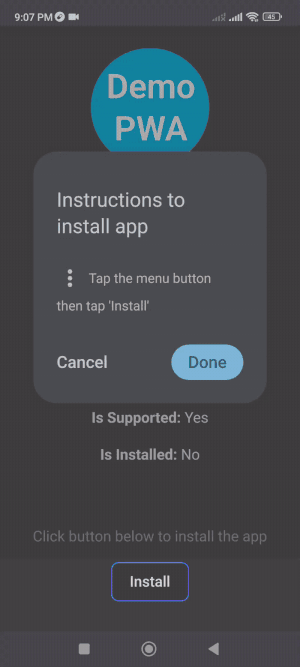
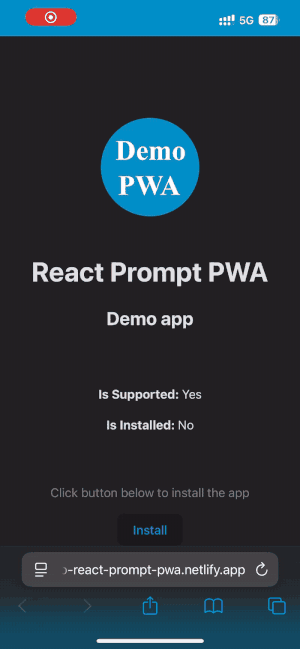

# react-prompt-pwa library
[](https://badge.fury.io/js/react-prompt-pwa)

Yet another library to display pwa installation prompt in a react application.

## Install

```
npm install react-prompt-pwa
```

Before using this library make sure your react application fulfils the [criteria for an installable progressive web app](https://web.dev/articles/install-criteria).

## Usage

It consists of two components - `PwaPromptProvider` component and `usePwaPrompt` hook.

Add provider in the root of your react application -

```ts
import { PwaPromptProvider } from "react-prompt-pwa";

function App() {
  // app code

  return (
    <PwaPromptProvider>
    {/* rest of the components */}
    </PwaPromptProvider>
  )
}
```

Use the hook in some other component in the hierarchy - 
```ts
import { usePwaPrompt } from "react-prompt-pwa";
function SomeComponent() {
  const {supported, installed, install} = usePwaPrompt();
  // component code
}
```

## Demo
Demo app url: https://demo-react-prompt-pwa.netlify.app/ 

**Screenshots (manual instruction prompt)**

| Android                                                         | iOS                                                     |
| --------------------------------------------------------------- | ------------------------------------------------------- |
|  |  |

## Docs
The `usePwaPrompt` hook returns an object with three properties -
1. `supported`: Whether the pwa installation is supported by the browser client.
2. `installed`: Whether the react app is opened through installed PWA.
3. `install`: This function shows the prompt for pwa installation when supported by the browser client. It returns a boolean value indicating whether user has successfully installed the PWA.

Please note that not every browser supports PWA installation and some have different instructions for manual install. Please feel free to raise an issue or a PR if you want to add support for your desired browser ✌️.